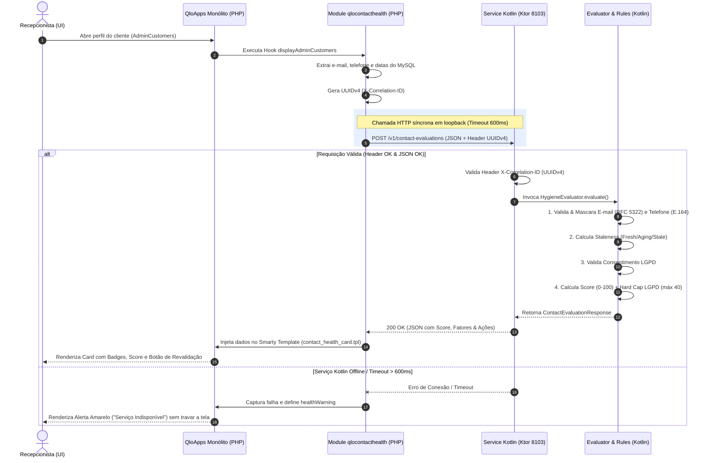
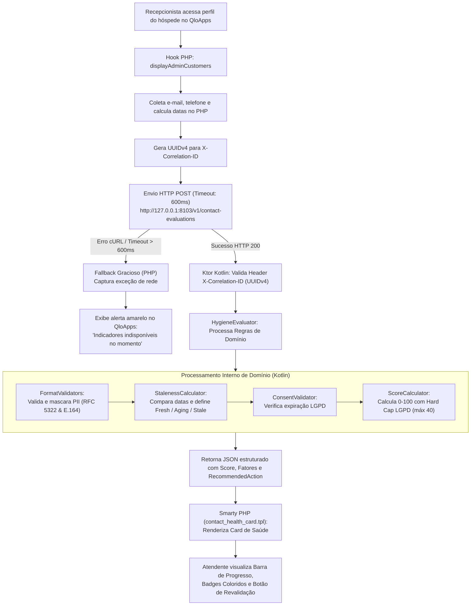

# Avaliador de Saúde e Higiene de Contatos de Hóspedes (`contact-health-service-kotlin` & `qlocontacthealth`)

Este documento apresenta a análise completa da especificação (**RFC-003**), da API HTTP, da implementação da lógica em **Kotlin/Ktor** e do módulo de integração em **PHP/Smarty** no QloApps. Ele foi estruturado para servir de roteiro direto e material de apoio para a montagem de uma apresentação executiva e técnica do projeto.

---

## 1. Overview (Visão Geral do Projeto)

### Contexto e Problema de Negócio
Em operações hoteleiras, a qualidade dos dados cadastrais dos hóspedes sofre rápida degradação:
- Mudança de números de telefone e e-mails corporativos ou pessoais.
- Expiração ou revogação de termos de consentimento de privacidade (**LGPD/GDPR**).
- **Consequências Operacionais:** Taxas elevadas de rejeição de e-mails (*bounce*), falhas no envio de vouchers de reserva, confirmações de check-in, cobranças de *no-show*, além de potenciais infrações regulatórias por uso indevido de dados sem consentimento ativo.

### O Que É a Solução
O **Avaliador de Saúde de Contatos** é uma solução híbrida composta por um microsserviço reativo em Kotlin e um módulo de visualização/integração em PHP no QloApps:
- **No Back-Office (Recepção):** Quando o atendente/recepcionista abre o perfil de um cliente no QloApps (`AdminCustomers` ou `AdminContactHealthController`), o sistema calcula em tempo real um **Score de Higiene (0 a 100)** e exibe o estado de envelhecimento e conformidade do cadastro.
- **Identificação Visual Instantânea:** Apresenta badges visuais coloridos (Verde = `FRESH`, Amarelo = `AGING`, Vermelho = `STALE` / `CONSENT_EXPIRED` / `INVALID_FORMAT`) e alerta a recepção para solicitar a atualização dos dados antes de finalizar o check-in.
- **Simulação de Revalidação:** Disponibiliza um botão de ação rápida para simular o disparo de desafios de reconfirmação de contato via e-mail/SMS.

### Arquitetura da Solução e Diagrama de Sequência



### Fluxograma de Execução do Processo




### Principais Funcionalidades Entregues
1. **Validação de Formatos Internacionais:** E-mail validado via RFC 5322 e Telefone validado no padrão internacional E.164 (`+5511999998888`).
2. **Classificação Temporal de Defasagem (Staleness):**
   - $\le 30\text{ dias}$: `FRESH` (Dados recentes, 0 penalidades).
   - $31$ a $90\text{ dias}$: `AGING` (Atenção, -15 pontos por fator).
   - $> 90\text{ dias}$ ou nulo: `STALE` (Obsoleto, -30 pontos por fator).
3. **Conformidade LGPD (Consentimento Regulatório):** Checagem contra a data de referência (`reference_date`). Se o consentimento estiver expirado ou ausente, limita o score máximo a 40 e marca o status geral como `CONSENT_EXPIRED`.
4. **Mascaramento Automático de PII:** E-mails (ex: `m***a@tech.com`) e telefones (ex: `+5511*****4567`) são mascarados antes da resposta HTTP, prevenindo vazamentos de dados pessoais em logs ou no frontend.
5. **Resiliência e Fallback Gracioso:** O QloApps impõe timeout de 600ms na chamada ao microsserviço Kotlin. Caso o serviço esteja offline ou demore a responder, o painel do cliente carrega normalmente e exibe um aviso sem travar a navegação.

---

## 2. Dificuldades e Desafios

### 1. Comunicação Síncrona entre Duas Pilhas Heterogêneas (PHP Legado vs Kotlin Reativo)
- **Desafio:** O QloApps é um monólito em PHP 8.1 / Smarty 3.x com renderização síncrona de páginas no servidor, enquanto a inteligência de cálculo foi isolada em um microsserviço Kotlin em Ktor/Netty. A chamada de rede durante a renderização do perfil do cliente poderia introduzir latência invisível no check-in.
- **Solução Aplicada:** Implementação de chamada HTTP cURL direta via loopback (`127.0.0.1:8103`) com limites estritos (`CURLOPT_TIMEOUT_MS = 600` e `CURLOPT_CONNECTTIMEOUT_MS = 300`). LATÊNCIA MEDIDA: latência de cálculo no Kotlin $< 5\text{ ms}$ e latência total ponta-a-ponta no PHP $< 40\text{ ms}$.

### 2. Tratamento Rigoroso de Privacidade (PII) e Rastreabilidade (Correlation ID)
- **Desafio:** Garantir a rastreabilidade total das requisições entre o PHP e o Kotlin para auditoria de atendimento sem expor dados pessoais (PII) em logs de console ou respostas brutas.
- **Solução Aplicada:** 
  - Criação da função `generateUuidV4()` no PHP para envio do header obrigatório `X-Correlation-ID`.
  - No Kotlin, validação estrita no Ktor do formato UUIDv4 (RFC 4122) com rejeição via HTTP 400 Bad Request se ausente ou malformado.
  - Implementação de algoritmos de mascaramento de strings no Kotlin (`maskEmail` e `maskPhone`) atuando na camada de domínio.

### 3. Normalização e Parsing Tolerante de Datas (ISO-8601 vs Formatos Nativos de Banco)
- **Desafio:** Compatibilizar os formatos de data gerados pelo banco MySQL do QloApps (`date_upd`, `date_add` em string/timestamp) com as exigências da API em ISO-8601 UTC (`YYYY-MM-DDTHH:MM:SSZ`) e `LocalDate` (`YYYY-MM-DD`).
- **Solução Aplicada:** Desenvolvimento de um parser tolerante no `StalenessCalculator.parseDate` que tenta sequencialmente `OffsetDateTime`, `Instant`, `LocalDateTime` e `LocalDate`, mitigando falhas de serialização.

### 4. Regra de Negócio Complexa: Penalidades Cumulativas vs Hard Caps
- **Desafio:** Conciliar a pontuação de múltiplos fatores (e-mail e telefone) com regras regulatórias soberanas (LGPD). Um cliente com e-mail e telefone válidos e recentes poderia ter um score de 100, porém se seu consentimento estivesse vencido há 1 dia, a comunicação seria ilegal.
- **Solução Aplicada:** Construção do `ScoreCalculator` em Kotlin com lógica de pontuação que aplica penalidades progressivas e, em seguida, impõe um *Hard Cap* máximo de 40 pontos (`score.coerceAtMost(40)`) se `consent_valid == false`.

---

## 3. Decisões de Projeto e Aspectos Técnicos

### 3.1. Arquitetura do Microsserviço Kotlin (`contact-health-service-kotlin`)

O projeto Kotlin adota os princípios de **Clean Architecture / Domain-Driven Design (DDD)** simples e sem acoplamento:

```text
com.hotel.contacthealth/
├── Application.kt                  # Ponto de entrada Ktor, rotas e tratamento de erros (StatusPages)
├── model/
│   ├── ContactModels.kt            # DTOs de Request, Response e ErrorResponse
│   └── FactorEnums.kt              # Enums (FactorType, FactorStatus, RecommendedAction)
├── domain/
│   ├── validation/
│   │   ├── FormatValidators.kt     # Regex RFC 5322 (E-mail), E.164 (Phone) e Mascaramento PII
│   │   └── ConsentValidator.kt     # Regras de expiração LGPD
│   └── calculation/
│       ├── StalenessCalculator.kt  # Decaimento temporal por data de referência
│       └── ScoreCalculator.kt      # Algoritmo de cálculo de higiene (0-100)
└── service/
    └── HygieneEvaluator.kt         # Service Facade / Orquestrador do Domínio
```

#### Escolhas Tecnológicas no Kotlin:
- **Framework Web:** Ktor 2.3 com engine **Netty** (leveza, baixo consumo de memória e rápida inicialização).
- **Serialização:** `kotlinx.serialization` para alta performance e imutabilidade de DTOs.
- **Tratamento de Exceções Centralizado:** Plugin `StatusPages` mapeando exceções de domínio e validação para o padrão **RFC 7807** (HTTP 400 Bad Request / HTTP 500).
- **Testes Automatizados:** JUnit 5 com `ktor-server-tests-host` cobrindo unitariamente os calculadores e integradamente os endpoints HTTP.

### 3.2. Contrato de API (OpenAPI / JSON Specification)

#### Endpoint Principal
- **Rota:** `POST http://127.0.0.1:8103/v1/contact-evaluations`
- **Headers:**
  - `Content-Type: application/json`
  - `X-Correlation-ID: <uuid-v4>` (Obrigatório)

#### Exemplo de Payload de Requisição (Request Body):
```json
{
  "customer_id": "cust-1042",
  "email": "carlos.silva@empresa.com.br",
  "phone": "+5511987654321",
  "last_verified_at": "2026-04-10T10:00:00Z",
  "consent_expires_at": "2026-12-31T23:59:59Z",
  "reference_date": "2026-08-27"
}
```

#### Exemplo de Resposta de Sucesso (Response 200 OK):
```json
{
  "correlation_id": "7a8b9c0d-1e2f-4a5b-8c6d-7e8f9a0b1c2d",
  "customer_id": "cust-1042",
  "overall_status": "AGING",
  "hygiene_score": 75,
  "factors": [
    {
      "type": "EMAIL",
      "value_masked": "c***a@empresa.com.br",
      "status": "AGING",
      "days_since_verification": 139,
      "issues": ["STALENESS_EXCEEDED_30_DAYS"]
    },
    {
      "type": "PHONE",
      "value_masked": "+5511*****4321",
      "status": "FRESH",
      "days_since_verification": 139,
      "issues": []
    }
  ],
  "consent_valid": true,
  "recommended_action": "TRIGGER_BACKGROUND_RECONFIRMATION"
}
```

---

### 3.3. Arquitetura do Módulo PHP no QloApps (`qlocontacthealth`)

O módulo PHP foi desenvolvido estritamente dentro dos padrões de extensores do QloApps/PrestaShop:

#### Componentes Principais:
1. **`qlocontacthealth.php` (Classe Principal do Módulo):**
   - Registra o módulo na categoria `administration`.
   - Registra o Hook nativo `displayAdminCustomers` para injeção automática da UI no perfil do cliente.
   - Gerencia configurações dinâmicas via `Configuration::updateValue()` (`QLOCONTACTHEALTH_API_URL` e `QLOCONTACTHEALTH_API_TIMEOUT`).
   - Fornece o método `evaluateCustomerContactHealth($customerId)` que executa a chamada cURL resiliênte.
   - Fornece o método estático `generateUuidV4()` para gerar a chave de correlação.
2. **`AdminContactHealthController.php` (Controller Administrativo):**
   - Cria uma aba dedicada no menu do sistema (`AdminParentCustomer -> Saúde de Contatos`).
   - Permite listar os clientes cadastrados e inspecionar individualmente a saúde do contato com botão de retorno à listagem.
3. **`contact_health_card.tpl` (Template Smarty):**
   - Interface limpa estilizada em Bootstrap / QloApps Back-Office UI.
   - Renderiza a barra de progresso colorida (`progress-bar-success`, `progress-bar-warning`, `progress-bar-danger`) proporcional ao `hygiene_score`.
   - Tabela detalhada de fatores com valores mascarados.
   - Botão para simulação de desafio de reconfirmação ativado condicionalmente quando `recommended_action != 'NONE'`.

---

## 4. Destaques para Roteiro de Apresentação (Slides Suggestion)

Se você for montar uma apresentação em slides (ex: PowerPoint / Google Slides), aqui está uma sugestão de estrutura:

| Slide | Título | Conteúdo Principal a Abordar |
|---|---|---|
| **Slide 1** | **Capa & Introdução** | Avaliador de Saúde e Higiene de Contatos (QLO-FEAT-003). |
| **Slide 2** | **O Problema de Negócio** | Perda de contato com hóspedes, e-mails rejeitados, ausência de conformidade LGPD na recepção. |
| **Slide 3** | **A Solução Proposta** | Microsserviço Kotlin calculador de score + Módulo PHP integrado nativamente ao QloApps. |
| **Slide 4** | **Arquitetura & Fluxo** | Diagrama de comunicação HTTP loopback, timeout de 600ms, fallback gracioso. |
| **Slide 5** | **Regras de Negócio & Algoritmo** | Defasagem temporal (Fresh/Aging/Stale), validação de formato E.164/RFC 5322 e cap regulatório LGPD. |
| **Slide 6** | **Desafios Técnicos Superados** | Latência síncrona vs experiência do atendente, mascaramento PII, resiliência e correlação com UUIDv4. |
| **Slide 7** | **Demonstração Prática (UI)** | Screenshots do painel do cliente no QloApps com os badges e barra de score de higiene. |
| **Slide 8** | **Conclusão & Próximos Passos** | Qualidade da base cadastral, conformidade com a LGPD e base para automação de revalidação por SMS/E-mail. |
